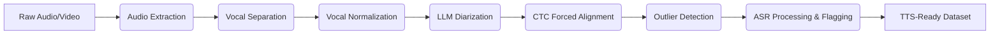

# TTSizer: Your End-to-End TTS Dataset Preparation Pipeline 🎙️✂️📊

TTSizer automates the creation of high-quality Text-To-Speech (TTS) datasets from raw audio/video. It processes multi-speaker content by performing speaker diarization, then extracts, cleans, and aligns audio clips for each target speaker. This comprehensive pipeline streamlines the often laborious journey from raw media to a structured, TTS-ready dataset through stages like vocal separation, normalization, forced alignment, and outlier detection.

[](https://opensource.org/licenses/Apache-2.0)
[](https://www.python.org/downloads/)
<!-- Add more badges here if you set up CI/CD, code coverage, etc. -->
<!-- Example: [](https://travis-ci.org/your_username/TTSizer) -->
<!-- Example: [](https://coveralls.io/github/your_username/TTSizer?branch=main) -->

## ✨ Core Features

*   🧩 **Modular & Sequential Pipeline:** Process audio through distinct, configurable, and sequential stages for fine-grained control over your workflow.
*   ⚙️ **Extensive Configuration:** Easily tailor all pipeline parameters via a central `config.yaml` file.
*   🗣️ **Multi-Speaker Support:** Efficiently handle projects involving one or multiple target speakers.
*   🤖 **State-of-the-Art Models:** Utilizes cutting-edge pre-trained models for critical tasks:
    *   Vocal Separation (MelBandRoformer)
    *   Speaker Diarization (Google Gemini)
    *   Forced Alignment (CTC-Forced-Aligner)
    *   Speaker Embeddings (WeSpeaker)
    *   ASR & Timestamping (Nemo Parakeet)
*   💪 **Robust Processing & Control:** Benefit from detailed logging, comprehensive error handling, and the flexibility to skip or resume specific pipeline stages.
*   🎯 **Quality-Focused Outlier Detection:** Automatically identifies and separates audio segments that could be detrimental to TTS training quality, helping to create cleaner datasets.

## 📊 Workflow Overview

Here's a visual representation of the TTSizer pipeline:



## 🚀 The Pipeline Stages

TTSizer processes your data through the following sequential stages:

1.  🎬 **Audio Extraction (`audio_extract`)**
    *   Extracts audio from various video formats (MKV, MP4, AVI).
    *   Intelligently selects preferred language audio streams.
    *   Optionally uses intermediate AAC encoding for high-res videos to optimize extraction.
    *   **Outputs:** Audio files (FLAC, WAV) in a structured directory.

2.  🎤 **Vocal Separation (`vocals_extract`)**
    *   Isolates vocal tracks from extracted (potentially mixed) audio.
    *   Uses MelBandRoformer model for high-quality vocal separation.
    *   **Outputs:** Vocal-only audio files.

3.  🔊 **Vocal Normalization (`vocals_normalize`)**
    *   Normalizes separated vocal audio to target loudness (LUFS) and true peak (TP) levels.
    *   Uses FFmpeg for precise, industry-standard normalization.
    *   **Outputs:** Normalized vocal audio files with consistent volume.

4.  ✍️ **LLM Diarization (`llm_diarize`)**
    *   Performs speaker diarization on normalized vocals using an LLM (Google Gemini).
    *   Identifies speaker turns and provides initial transcriptions.
    *   **Outputs:** JSON files with diarization info (speaker labels, timestamps, transcripts).

5.  ⏱️ **CTC Forced Alignment (`ctc_align`)**
    *   Precisely aligns diarized audio segments with text using a CTC-based model.
    *   Generates accurately timed audio segments and corresponding transcripts.
    *   Handles regular speech and "expression" segments (laughter, sighs).
    *   **Outputs:** Short, aligned audio clips (`.wav`/`.flac`) and `.txt` files per speaker.

6.  🧐 **Outlier Detection (`outlier_detect`)**
    *   Analyzes aligned audio clips per target speaker to find outliers.
    *   Generates a WeSpeaker voice profile (centroid embedding) for each speaker.
    *   Compares clips to speaker profiles, categorizing as `definite`, `uncertain`, or `outliers`.
    *   **Outputs:** Moves files into respective subdirectories for review/exclusion.

7.  🚩 **ASR Processing & Flagging (`asr_process`)**
    *   Processes 'definite' clips with a Nemo Parakeet ASR model.
    *   Transcribes clips and extracts word-level timestamps.
    *   Flags segments if ASR speech boundaries significantly differ from audio file limits (helps find silence/non-speech).
    *   **Outputs:** Flagged audio (with padding) and transcripts for manual review.

## 🏗️ Project Structure

The project is organized as follows:

```
TTSizer/
├── configs/
│   ├── config.yaml                 # Main configuration file for the pipeline
│   ├── prompt_template.txt         # Prompt template for LLM Diarization stage
│   └── config_kimmel_unwa_ft.yaml  # Config for Kimmel model
├── ttsizer/
│   ├── __init__.py
│   ├── main.py                     # Main script to run the pipeline
│   ├── core/                       # Core components of the pipeline
│   │   ├── __init__.py
│   │   ├── audio_extract.py
│   │   ├── vocals_extract.py
│   │   ├── vocals_normalize.py
│   │   ├── llm_diarize.py
│   │   ├── ctc_align.py
│   │   ├── outlier_detect.py
│   │   └── asr_process.py
│   ├── models/
│   │   ├── __init__.py             
│   │   └── bs_roformer/            # BS Roformer model package
│   │       ├── __init__.py
│   │       ├── bs_roformer.py      # Core BS Roformer model code
│   │       ├── mel_band_roformer.py # MelBandRoformer model code
│   │       └── ...                 # Other model-related files
│   └── utils/
│       ├── __init__.py
│       ├── logger.py               # Logging setup and utilities
│       └── vocal_utils.py          # Utility functions for vocal processing
├── .env                            # For API keys
├── README.md                       # This file
├── requirements.txt                # Python package dependencies
└── weights/                        # For storing downloaded model weights (gitignored)
```

## 🛠️ Setup & Installation

1.  **Clone the Repository:**
    ```bash
    git clone https://github.com/taresh18/TTSizer.git
    cd TTSizer
    ```

2.  **Python Environment:**
    *   It's recommended to use a virtual environment (e.g., venv, conda).
    *   Python 3.9+ is advisable.

3.  **Install Dependencies:**
    *   **FFmpeg:** Ensure FFmpeg is installed and accessible in your system's PATH. It's crucial for `vocals_normalize` and `audio_extract`.
    *   **Python Packages:**
        ```bash
        pip install -r requirements.txt
        ```

4.  **API Keys & Environment Variables:**
    *   For the `llm_diarize` stage using Google Gemini, you need a `GEMINI_API_KEY`.
    *   Create a `.env` file in the project root: `GEMINI_API_KEY="your_api_key_here"`.

5.  **Pre-trained Models:**

    Two models require manual download. Other models are downloaded automatically by their respective libraries on first use if a Hugging Face model identifier is provided in `config.yaml`.

    **Manual Downloads:**

    1.  **Vocal Separation Model (`vocals_extract.model_path`):**
        *   **Download:** From Hugging Face: `pcunwa/Kim-Mel-Band-Roformer-FT` (specifically the `ft2-bleedless` checkpoint, e.g., `kimmel_unwa_ft2_bleedless.ckpt`).
        *   **Setup:** Place the downloaded model file (e.g., into a `weights/` directory) and update `vocals_extract.model_path` in `config.yaml` with the correct local path.

    2.  **Speaker Embedding Model (`outlier_detector.embedding_model_path`):**
        *   **Download:** From Hugging Face: `Wespeaker/wespeaker-voxceleb-resnet293-LM`.
        *   **Setup:** Download the model files/directory, place them (e.g., into the `weights/` directory), and update `outlier_detector.embedding_model_path` in `config.yaml` with the correct local path.

## ⚙️ Configuration

The entire pipeline is controlled by `configs/config.yaml`. Key sections to configure:

*   **`project_setup`**:
    *   `video_input_base_dir`: Path to your raw video/audio files.
    *   `output_base_dir`: Where all processed data will be saved.
    *   `series_name`: A specific name for your current project or dataset.
    *   `target_speaker_labels`: A list of exact speaker names/labels as they appear (or are desired) in diarization/transcripts.
*   **Stage-Specific Configurations**: Each pipeline stage (e.g., `audio_extractor`, `vocals_extractor`, `llm_diarizer`, etc.) has its own section.
    *   `output_folder`: Defines the subdirectory name for that stage's output.
    *   Model paths, thresholds, batch sizes, language codes, etc.
*   **`logging_config`**: Settings for log file name, level, and formatting.
*   **Prompt Templates**: The `llm_diarizer` uses a prompt template (e.g., `configs/prompt_template.txt`).

**Example `config.yaml` structure (illustrative):**
```yaml
project_setup:
  video_input_base_dir: "/path/to/your/raw_videos_or_audio"
  output_base_dir: "/path/to/your/tts_dataset_output"
  series_name: "MyTTS_Project_Alice"
  target_speaker_labels: ["Alice"]

pipeline_control:                 # Control which stages run
  run_only_stage: null            # e.g., "vocals_extract"
  start_stage: null               # e.g., "llm_diarize"
  end_stage: null                 # e.g., "ctc_align"

logging_config:
  log_file_name: "ttsizer_pipeline.log"
  # ... other logging settings

audio_extractor:
  output_folder: "extracted_audio"
  # ... other audio_extractor settings

vocals_extractor:
  output_folder: "vocals_separated"
  model_path: "/path/to/your/bs_roformer_model.pth"
  # ... other vocals_extractor settings

# ... configurations for all other stages (vocals_normalizer, llm_diarizer, etc.)
```

## ▶️ Running the Pipeline

1.  **Prepare Configuration & API Key:**
    *   Thoroughly configure `configs/config.yaml` with all necessary paths (input, output, model locations) and stage-specific parameters.
    *   For the `llm_diarize` stage, ensure your `GEMINI_API_KEY` is correctly set in a `.env` file at the project root (e.g., `GEMINI_API_KEY="your_actual_api_key"`).

2.  **Control Stage Execution (Optional):**
    *   Adjust the `pipeline_control` section within `configs/config.yaml` to run only specific stages, or to define custom start and end points for your processing run.

3.  **Execute the Pipeline:**
    *   Navigate to the project's root directory and run the main script using:
        ```bash
        python -m ttsizer.main
        ```
    *   The pipeline will automatically use the `configs/config.yaml` file.

## 📜 License

This project is licensed under the Apache License, Version 2.0. You may obtain a copy of the License at:

   http://www.apache.org/licenses/LICENSE-2.0

Unless required by applicable law or agreed to in writing, software
distributed under the License is distributed on an "AS IS" BASIS,
WITHOUTHOUT WARRANTIES OR CONDITIONS OF ANY KIND, either express or implied.
See the License for the specific language governing permissions and
limitations under the License.