# TTSizer 🎙️✨
### Transform Raw Audio/Video into Production-Ready TTS Datasets

<!--**Watch the TTSizer Demo & See It In Action:**-->

[](https://youtu.be/POwMVTwsZDQ?si=rxNy7grLyROhdIEd)

*(The demo above showcases the [AnimeVox Character TTS Corpus](https://huggingface.co/datasets/taresh18/AnimeVox), a dataset created using TTSizer.)*

## 🎯 What It Does

TTSizer automates the tedious process of creating high-quality Text-To-Speech datasets from raw media. Input a video or audio file, and get back perfectly aligned audio-text pairs for each speaker.

## ✨ Key Features

🎯 **End-to-End Automation**: From raw media files to cleaned, TTS-ready datasets   
🗣️ **Advanced Multi-Speaker Diarization**: Handles complex audio with multiple speakers  
🤖 **State-of-the-Art Models** - MelBandRoformer, Gemini, CTC-Aligner, Wespeaker       
🧐 **Quality Control**: Automatic outlier detection and flagging  
⚙️ **Fully Configurable**: Control every aspect via `config.yaml` 

## 📊 Pipeline Flow

```mermaid
graph LR
    A[🎬 Raw Media] --> B[🎤 Extract Audio]
    B --> C[🔇 Vocal Separation]  
    C --> D[🔊 Normalize Volume]
    D --> E[✍️ Speaker Diarization]
    E --> F[⏱️ Forced Alignment]
    F --> G[🧐 Outlier Detection]
    G --> H[🚩 ASR Validation]
    H --> I[✅ TTS Dataset]
```



## 🏃 Quick Start

### 1. Clone & Install
```bash
git clone https://github.com/taresh18/TTSizer.git
cd TTSizer
pip install -r requirements.txt
```

### 2. Setup Models & API Key
- Download pre-trained models (see [Setup Guide](#setup--installation))
- Add `GEMINI_API_KEY` to `.env` file in the project root:
```bash
GEMINI_API_KEY="YOUR_API_KEY_HERE"
```

### 3. Configure
Edit `configs/config.yaml`:
```yaml
project_setup:
  video_input_base_dir: "/path/to/your/videos"
  output_base_dir: "/path/to/output"
  target_speaker_labels: ["Speaker1", "Speaker2"]
```

### 4. Run TTSizer!
```bash
python -m ttsizer.main
```

## 🛠️ Setup & Installation

<details>
<summary>Click to expand detailed setup instructions</summary>

### Prerequisites
- Python 3.9+
- CUDA enabled GPU (>4GB VRAM)
- FFmpeg (Must be installed and accessible in your system's PATH)
- Google Gemini API key

### Manual Model Downloads
1. **Vocal Extraction**: Download `kimmel_unwa_ft2_bleedless.ckpt` from [HuggingFace](https://huggingface.co/pcunwa/Kim-Mel-Band-Roformer-FT)
2. **Speaker Embeddings**: Download from [wespeaker-voxceleb-resnet293-LM](https://huggingface.co/Wespeaker/wespeaker-voxceleb-resnet293-LM)

Update model paths in `config.yaml`.

</details>

## ⚙️ Advanced Configuration

<details>
<summary>Click for pipeline control and other advanced options</summary>

### Selective Stage Execution
You can control which parts of the pipeline run, useful for debugging or reprocessing:

```yaml
pipeline_control:
  run_only_stage: "ctc_align"      # Run specific stage only
  start_stage: "llm_diarize"       # Start from specific stage  
  end_stage: "outlier_detect"      # Stop at specific stage
```

</details>

## 🏗️ Project Structure

The project is organized as follows:

```
TTSizer/
├── configs/
│   └── config.yaml                 # Pipeline & model configurations
├── ttsizer/
│   ├── __init__.py
│   ├── main.py                     # Main script to run the pipeline
│   │── core/                       # Core components of the pipeline
│   ├── models/                     # Vocal removal models
│   └── utils/                      # Utility programs
├── .env                            # For API keys
├── README.md                       # This file
├── requirements.txt                # Python package dependencies
└── weights/                        # For storing downloaded model weights (gitignored)
```

## 📜 License

This project is released under the Apache License 2.0. See the [LICENSE](LICENSE) file for details.

## 📚 References

*   **Vocals Extraction** [pcunwa/Kim-Mel-Band-Roformer-FT](https://huggingface.co/pcunwa/Kim-Mel-Band-Roformer-FT) by Unwa
*   **Forced Alignment:** [ctc-forced-aligner](https://github.com/MahmoudAshraf97/ctc-forced-aligner) by MahmoudAshraf97
*   **ASR:** [NVIDIA NeMo Parakeet](https://docs.nvidia.com/nemo-framework/user-guide/latest/nemotoolkit/asr/models.html#fast-conformer)
*   **Speaker Embeddings:** [Wespeaker/wespeaker-voxceleb-resnet293-LM](https://huggingface.co/Wespeaker/wespeaker-voxceleb-resnet293-LM) from Wespeaker
